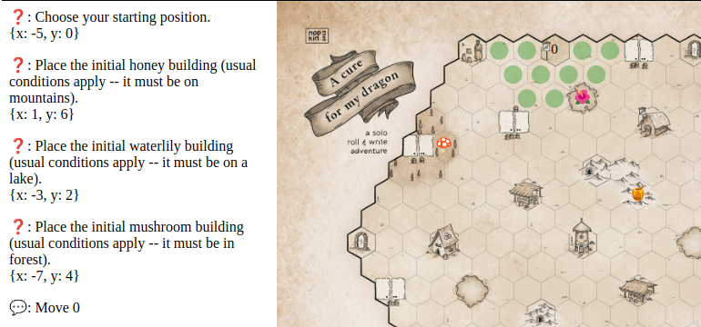
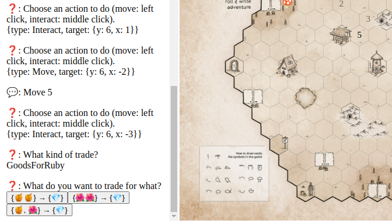
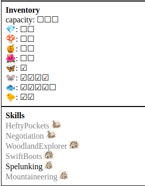
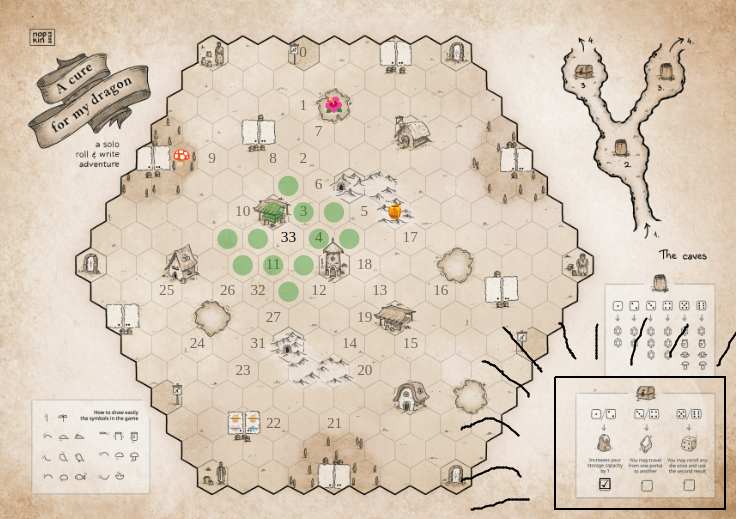
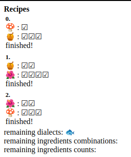

# A cure for my dragon

An implementation of this print-and-play game:
[https://boardgamegeek.com/blogpost/141155/print-and-play-cure-my-dragon](https://boardgamegeek.com/blogpost/141155/print-and-play-cure-my-dragon)

more info here:
[https://boardgamegeek.com/thread/2969899/wip-cure-my-dragon-13th-roll-write-game-design-con/page/1](https://boardgamegeek.com/thread/2969899/wip-cure-my-dragon-13th-roll-write-game-design-con/page/1)

If you find any bugs, feel free to file an issue.

# Trailer

(Purpose of trailer is mainly to show controls, not to be an exhaustive rules explanation. For that, see one of the above links.)

Your dragon is sick. What can be done? You have to set out on a journey to brew the spiciest most arcane recipes of all time to bring him back!

Trade ingredients on the markets

accumulate a ton of ingredients and learn new skills to help you along the way

discover legendary artifacts

and a shit ton of other stuff (among them collecting pages from old books, translating them then assembling them to obtain the recipes) so that finally,
your recipe is finished!

(And then you have to go back to your original position. That is not implemented --
the original position will be blocked -- but that's the least. You know when you win.)

[https://buj.github.io/a_cure_for_my_dragon/](https://buj.github.io/a_cure_for_my_dragon/)
